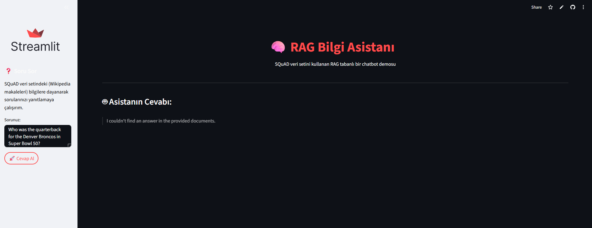

# RAG Bilgi Asistanı 

Bu proje, Akbank & Global AI Hub tarafından düzenlenen GenAI Bootcamp'in bitirme projesi olarak geliştirilmiştir.

---

## 1. Projenin Amacı

Bu projenin temel amacı, **Retrieval Augmented Generation (RAG)** mimarisine dayalı bir chatbot (bilgi asistanı) başarıyla oluşturmak ve dağıtmaktır. Veri seti bulma zorlukları nedeniyle proje, sağlam ve güvenilir **Stanford Question Answering Dataset (SQuAD)** kullanılarak adapte edilmiştir.

Asistan, kullanıcının sorduğu soruyu alıp, SQuAD bilgi tabanından (Wikipedia makaleleri kütüphanesi) en alakalı metin parçalarını almak ve bu bilgilere dayanarak kapsamlı, insan benzeri bir cevap üretmek için Google'ın **Gemini** modelini kullanmak üzere tasarlanmıştır. Sistemin önemli bir özelliği, bilgi tabanında bulunmayan sorular için cevap uydurmak yerine **"Bilmiyorum"** diyebilmesidir (Halüsinasyon Önleme).

---

## 2. Veri Seti Hakkında Bilgi

Projede, Hugging Face `datasets` kütüphanesi aracılığıyla erişilen **Stanford Question Answering Dataset (SQuAD)** kullanılmıştır.

* **Kaynak:** Wikipedia makaleleri.
* **Kullanılan Bölüm:** Geliştirme sürecini optimize etmek amacıyla `train` bölümünün ilk **2000 satırı** (`train[:2000]`) kullanılmıştır.
* **Hazırlık:** Tekrar eden metin parçaları çıkarılarak ve indeks sıfırlanarak RAG sistemi için temiz bir doküman kütüphanesi (`my_rag_library_local.pkl`) oluşturulmuştur.

---

## 3. Kullanılan Yöntemler ve Çözüm Mimarisi 

Proje, **RAG** mimarisi temel alınarak geliştirilmiştir.

### **RAG Akış Şeması:**

* **Metin Olarak:**
    ```
    [Kullanıcı Sorusu] -> [Soru Embedding (local_model)] -> [Vektör Arama (Cosine Sim.)] -> [En Alakalı Metinler (Context)] -> [(Context + Soru) -> Gemini Modeli] -> [Nihai Cevap]
    ```

### ** Kullanılan Teknolojiler:**

* **Veri:** Hugging Face `datasets` (SQuAD)
* **Embedding:** `sentence-transformers` (`all-mpnet-base-v2`)
* **Arama:** `scikit-learn` (Cosine Similarity)
* **Generation:** Google Gemini API (`gemini-2.5-flash`)
* **Arayüz:** Streamlit
* **Deployment:** Streamlit Community Cloud
* **Dil:** Python

<p align="center">
  
  
  
  
</p>

---

## 4. Elde Edilen Sonuçlar

* Çalışan bir RAG chatbot prototipi başarıyla oluşturulmuş ve Streamlit Cloud üzerinden canlıya alınmıştır.
* Sistem, SQuAD veri setinin kullanılan bölümündeki konularla ilgili sorulara tutarlı cevaplar üretebilmektedir:
    
    
* Kapsam dışı sorulara karşı sistemin halüsinasyon görmeyip **"I couldn't find an answer..."** demesi, RAG mimarisinin güvenilirliğini göstermektedir:
     
* Lokal embedding modeli kullanımı, API limit sorunlarını aşmada etkili olmuştur.

---

## 5. Web Arayüzü & Çalıştırma Kılavuzu 

### ** Canlı Demo Linki:**

[https://rag-app-assistant-24apsjvzcbho79iaanyg4a.streamlit.app/](https://rag-app-assistant-24apsjvzcbho79iaanyg4a.streamlit.app/) 

### **Arayüz Önizlemesi:**


### ** Proje Dosya Yapısı:**

* **Metin Olarak:**
    ```
    RAG-QA-Assistant/
    ├── app.py                  # Streamlit uygulama kodu
    ├── requirements.txt        # Gerekli kütüphaneler
    ├── my_rag_library_local.pkl # Oluşturulan vektör kütüphanesi
    ├── images/                 # Ekran görüntüleri ve şemalar
    │   ├── arayuz_genel.png      # (Varsayılan ad)
    │   ├── cevap_bulundu.png     # (Varsayılan ad)
    │   ├── cevap_bulunamadi.png  # (Varsayılan ad)
    │   └── ... (Diğer resimler)
    └── README.md               # Bu dosya
    ```

### ** Lokalde Çalıştırma:**

1.  **Depoyu Klonla:**
    ```bash
    git clone [https://github.com/sevvlay/RAG-QA-Assistant](https://github.com/sevvlay/RAG-QA-Assistant)
    cd RAG-QA-Assistant
    ```
2.  **Kütüphaneleri Yükle:**
    ```bash
    pip install -r requirements.txt
    ```
3.  **API Anahtarını Ayarla:** Google Gemini API anahtarını ortam değişkeni olarak ayarla:
    ```bash
    # Örnek (Linux/macOS):
    export GOOGLE_API_KEY='AIzaSy...'
    ```
    *(Daha güvenli yöntemler için Streamlit Secrets dokümantasyonuna bakınız)*
4.  **Uygulamayı Başlat:**
    ```bash
    streamlit run app.py
    ```

---
